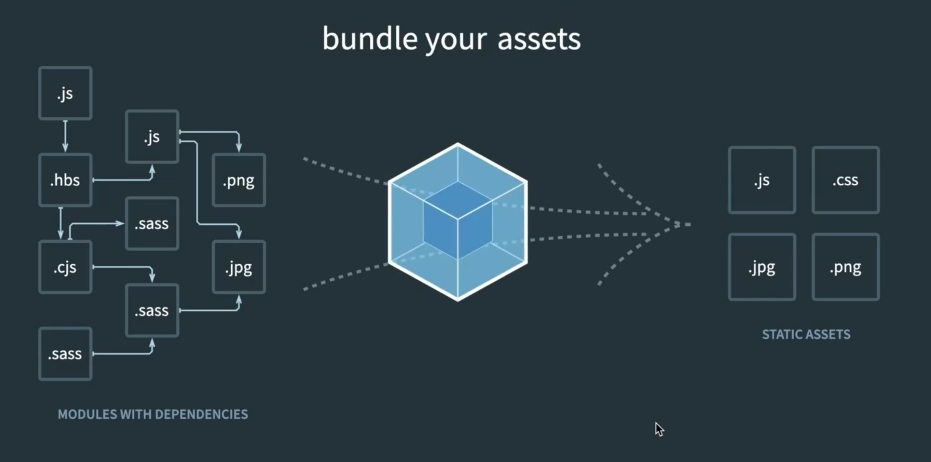
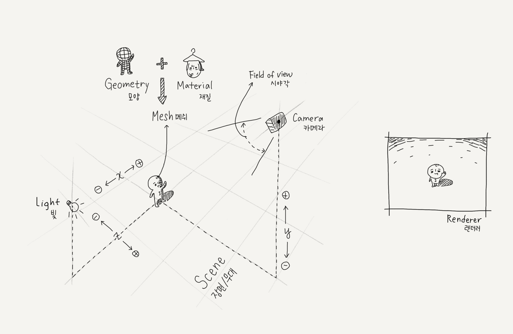

# three.js

[공식문서](https://threejs.org/docs/index.html#manual/en/introduction/Creating-a-scene)

## WebGL

Web Graphics Library의 약자 -> 웹상에서 2d 및 3d 그래픽을 렌더링하기 위한 로우 레벨 javascript api


* 장점
  * 로열티 없이 누구나 사용 가능
  * 렌더링 가속화 -> 그래픽 하드웨어 활용
  * 별도의 플로그인 필요 x, 웹 브라우저에 내장되어 실행
  * 자바스크립트 프로그래밍 가능
  * 모바일 브라우저에서도 사용 가능


## Three.js

웹 브라우저에서 3차원 컴퓨터 그래픽스 애니메이션 응용을 만들고 표현하기 위해 사용되는 자바스크립트 라이브러리, api

오픈 소스 프로젝트-> 깃허브에 공개


## 개발하기 전에

1. vscode
   * extensions: live server 설치(로컬에서 웹 서버 손쉽게 구동)
2. chrome
3. [three.js](https://threejs.org/) 홈페이지에서 [code] - [download]
   1. three.js : 전통적인 javascript방식(three.min.js는 three.js를 압축해놓은 방식)
   2. three.module.js : 모듈화 해놓은 방식
4. three.js 와 같은 폴더 안에 index.html을 만들고 안에 공식문서의 마지막 html 코드 복붙
5. index.html 내의 script src에서 script 경로 조정 
6. vscode로 index.html에 들어가서 우클릭 후 `open with live server` 클릭
7. `npm i -D @babel/cli @babel/core @babel/preset-env babel-loader clean-webpack-plugin copy-webpack-plugin core-js cross-env html-webpack-plugin source-map-loader terser-webpack-plugin webpack webpack-cli webpack-dev-server`: 모듈 설치
8. `npm i three`
9. `npm start`: 개발용 서버 구동
10. `npm run build`: 빌드(배포용 파일 생성)


## 모듈을 이용한 방식

### 자바 모듈 스크립트

1. 모듈을 사용하지 않는 방법

   ```js
   // hello.js
   function hello1() {
     console.log("Hello 1!");
   }
   ```

   ```js
   // main.js
   hello1();
   ```

   ```html
   <!--index.html -->
   <!DOCTYPE html>
   <html lang="en">
     <head>
       <meta charset="UTF-8" />
       <meta http-equiv="X-UA-Compatible" content="IE=edge" />
       <meta name="viewport" content="width=device-width, initial-scale=1.0" />
       <title>Document</title>
     </head>
     <body>
       <script src="hello.js"></script>
       <script src="main.js"></script>
     </body>
   </html>
   ```

   

2. 모듈을 사용

   장점: 여러 개의 파일을 다 로드 하는게 아니라 메인이 되는 js 하나만 html에 연결시켜놓고, 나머지 js안에서 다른 js를 포함시킬 수 있음

   ```js
   // hello.js
   export function hello1() {
     console.log("Hello 1!");
   }
   
   export function hello2() {
       console.log("Hello 2!");
   }
   ```

   ```js
   // main.js
   import { hello1 } from './hello.js';
   import { hello2 } from './hello.js';
   hello1();
   hello2();
   
   // or 다같이 가져오게
   import { hello1, hello2 } from './hello.js';
   
   // or 한꺼번에 가져오기
   import * as hello from './hello.js';
   hello.hello1();
   hello.hello2();
   
   // hello.js에서 export default function 이라고 해주면 {} 없이 사용 가능
   ```

   ```html
   <!--index.html -->
   <!DOCTYPE html>
   <html lang="en">
     <head>
       <meta charset="UTF-8" />
       <meta http-equiv="X-UA-Compatible" content="IE=edge" />
       <meta name="viewport" content="width=device-width, initial-scale=1.0" />
       <title>Document</title>
     </head>
     <body>
       <script type="module" src="main.js"></script>
     </body>
   </html>
   ```

   


### 웹팩 이용 방식



번들링: 자바스크립트, 이미지 등 모든 파일을 개별의 모듈로보고 배포용으로 병합하고 포장하는 방식 (through 번들러)

번들러 중 가장 많은 인기 많은 아이가 웹팩!


[웹팩](https://github.com/jmyoow/webpack-js-html)에서 clone받기


## 이미지로 이해하기



scene에 모든게 다 올라감

오브젝트 하나하나를 메쉬로 구성 (geometry모양 + material재질로 구성)

카메라, 시야각 

조명(재질이 어떤거냐에 따라 필요하거나 필요하지 않음)

씬을 화면에 그려주는 것을 렌더러(renderer)라고 함


x: 좌우 이동

y: 위아래(위: +/ 아래 : -)

z: 앞뒤(앞 : + / 뒤: -)


## 소스 코드 구조

main.js에서 모듈을 불러오기!